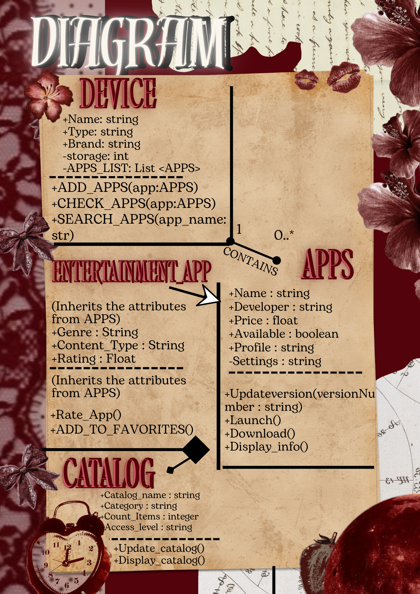
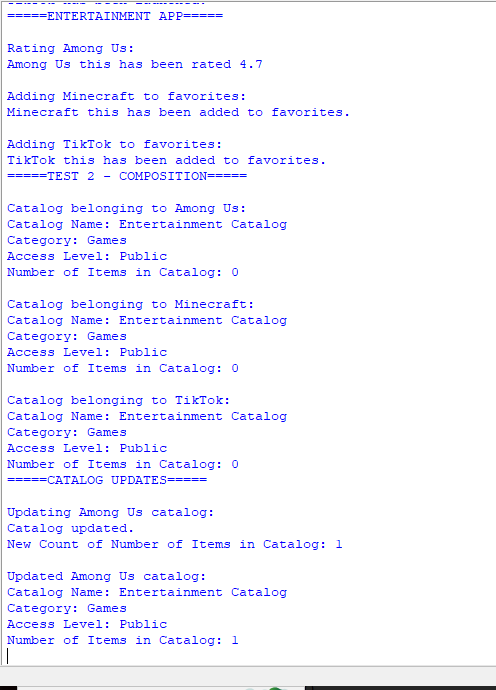
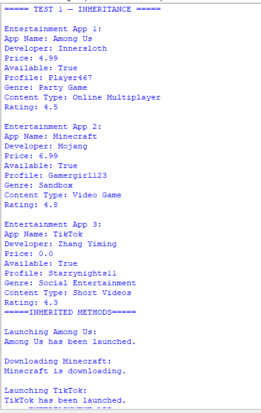
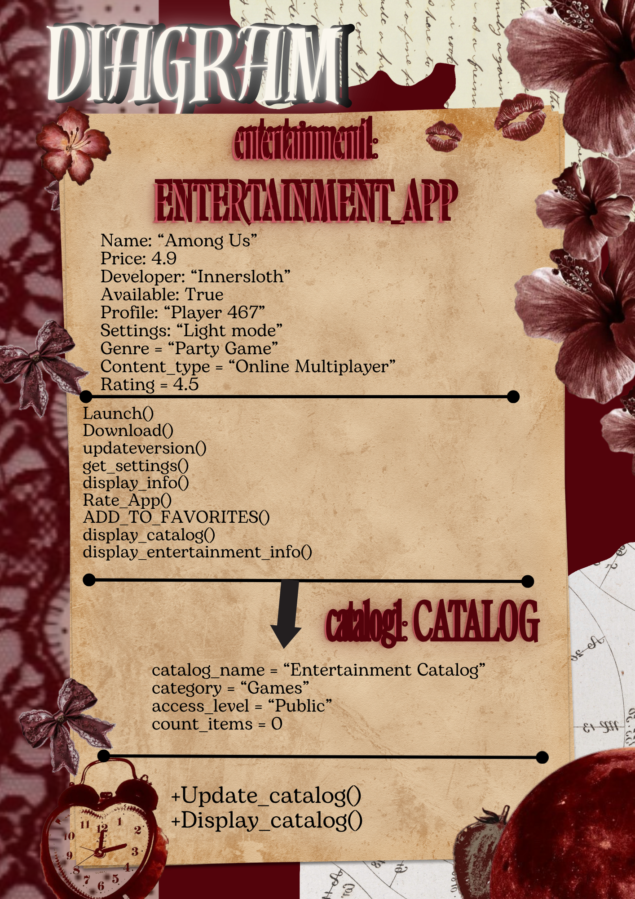

# Advanced Class Relationships

## Previous Activities

[classAttrib](classAttributesMethods.md)

[classRel](classRelationships.md)

## Existing System Description:

### What classes currently exist in your system?

Class 1: APPS

Class 2: DEVICE

###  What problem or limitation exists in your current design?

My current design uses an association between DEVICE and APPS, where one DEVICE can contain many APPS. But the problem here is all apps are treated as the same type of object. It does not distinguish between different categories of apps, if it is educational, provides entertainment or communication-related. This can make the system less organized and make it hard to add features that are specific to certain types of apps. My current design also does not show a stronger HAS-A relationship between the DEVICE and the APPS. 

## Inheritance Relationship

Parent: APPS

Child: ENTERTAINMENT_APP

Explanation: ENTERTAINMENT_APP IS-A type of APPS object because it has common characteristics of an APP, such as a name, developer, price, availability and version. The parent class is related to the child class because it specializes the parent class by adding entertainment information and functionality, like it's entertainment genre and content.

## Inheritance UML

[Inheritance](images/InheritanceDiagram.png)

## Composition/Aggregation

Relationship: Composition

Class containing another object: ENTERTAINMENT_APP

Contained object: CATALOG

Explanation: This has a composition relationship because the ENTERTAINMENT_APP creates its own CATALOG object, so the catalog is owned by the app in the system.

## Advanced UML Diagram

## Python Implementation

[Source Code](advancedRelationships.py)

## Test Run

## Object Diagram

## Reflection
Answers:

### Why did you choose your inheritance relationship? Explain why your child class is a type of your parent class.

  I chose my inheritance relationship because an ENTERTAINMENT APP is a type of app. Also because ENTERTAINMENT_APP has the same general information as the parent class, APPS. This includes, name, developer, price, available/availability, settings, and profile. it also includes additional information that specifies to entertainment apps. therefore my child class follows the IS-A relationship with APPS. 

### How did inheritance reduce duplicate code? Identify attributes or methods that were reused.

Inheritance reduces the duplicate code by not having to rewrite the attributes and methods already found in the APPS class. The attributes that were reused are name, developer, price, available, settings and profile. It not only reuses attributes but also methods such as Launch(), Download(), Update_version(), and Display_info().

### Why is your HAS-A relationship Composition or Aggregation? Explain the lifecycle relationship between the two objects.

My HAS-A relationship is Composition because ENTERTAINMENT_APP makes its own CATALOG object inside its constructor. It creates and owns its catalog instead of receiving an already existing catalog.

### What is the difference between Association from Part III and the advanced relationship you implemented?

The association from Part III connects DEVICE and APPS because DEVICE can contain multiple apps but the app objects are created independently. While the advance relationship between ENTERTAINMENT_APP and CATALOG is different because the ENTERTAINMENT_APP creates its own catalog. I also added inheritance.

### How does your design follow the DRY principle?

My design follows the DRY principle by placing common app attributes and methods in the APPS parent class. Instead of repeating the same constructor, the methods inside ENTERTAINMENT_APP like launch(), download() and others inherit them instead.
