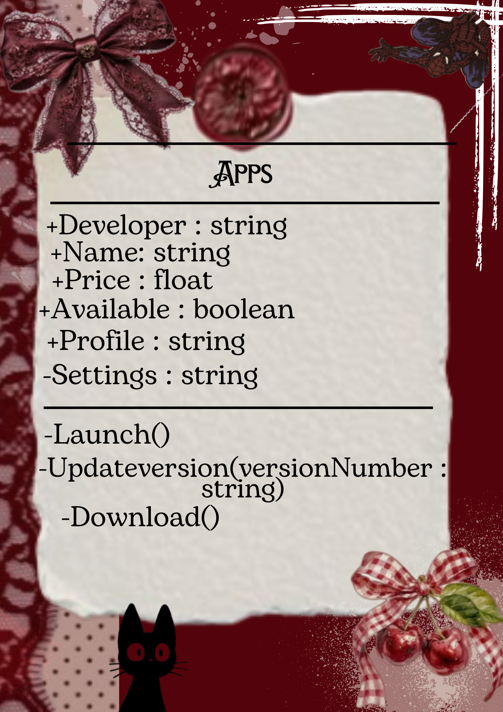

# Class Attributes and Methods
## Previous Design
Link to my previous activity:
[classObjectUML.md](classObjectUML.md)
---
## Design Revision
 Changes from my previous design:
- Fixed Formatting
- Updated the design explanation section for clarity and emphasis.
---
### Visibility Decisions
| Attribute | Data Type | Visibility | Reason |
|---|---|---|---|
| Name | String | Public | It should be public, so that people can search for the title and download the app. |
| Developer | String | Public | It should be public because the developer must be known as the developer of the app and credits. |
|Price |Float |Public | It is public to show the buyers of the app how much it costs. |
| Available | Boolean | Public | It is public because it shows if the app is still available or not, so the users would be updated. |
| Profile | String | Public | It is public so that users can know your identity that you inputed. |
| Settings | String | Private | It is private because the settings will only be seen for you, so you can customize your experience and check for problems. |

---
## Updated UML Class Diagram

---
## Python Implementation
[View Python Source](classImplementation.py)
---
## Test Run

---
## Object Diagram

---
## Analysis
### Why did you make your chosen attribute private?
### Which method changes the state of your object?
### How did your two objects demonstrate that instances are independent?
### What is the difference between your class diagram and your object diagram?
