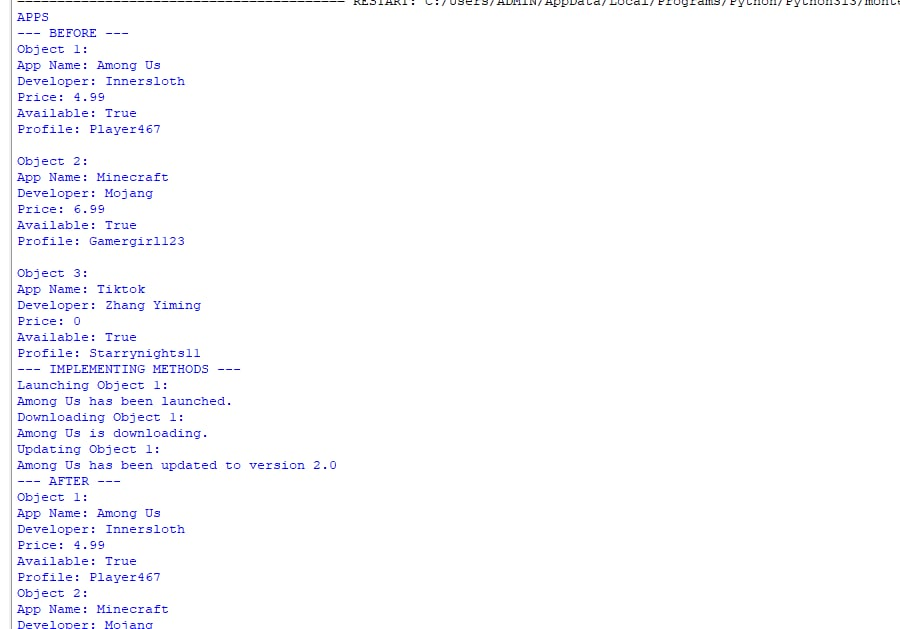

# Class Attributes and Methods
## Previous Design
Link to my previous activity:
[classObjectUML.md](classObjectUML.md)
---
## Design Revision
 Changes from my previous design:
- Fixed Formatting
- Updated the design explanation section for clarity and emphasis.
---
### Visibility Decisions
| Attribute | Data Type | Visibility | Reason |
|---|---|---|---|
| Name | String | Public | It should be public, so that people can search for the title and download the app. |
| Developer | String | Public | It should be public because the developer must be known as the developer of the app and credits. |
|Price |Float |Public | It is public to show the buyers of the app how much it costs. |
| Available | Boolean | Public | It is public because it shows if the app is still available or not, so the users would be updated. |
| Profile | String | Public | It is public so that users can know your identity that you inputed. |
| Settings | String | Private | It is private because the settings will only be seen for you, so you can customize your experience and check for problems. |

---
## Updated UML Class Diagram

---
## Python Implementation
[View Python Source](classImplementation.py)
---
## Test Run

---
## Object Diagram

---
## Analysis

### Why did you make your chosen attribute private?

I made the Settings attribute private because Settings holds the user’s settings and should not be altered directly by other parts of the program. If other parts of the program could change Settings directly Settings might be changed by accident or without the user’s control. Making Settings private helps protect the information of the object. I can still. Change Settings using methods that are specifically made for that purpose.

### Which method changes the state of your object?

The Updateversion() method changes the state of my object. Updateversion() changes the private Settings attribute by assigning it a value through self.__settings. For example when I update Object 1 Settings of Object 1 can change while Settings of the objects stay the same. This shows that Updateversion() modifies the object’s state.

### How did your two objects demonstrate that instances are independent?

My two objects were created from the APPS class but had different information and Settings. When I used a method to change Object 1 the state of Object 1 changed. Object 2 kept its values showing that changing one instance does not automatically change another instance. This demonstrates that each object has its independent state.

### What is the difference, between your class diagram and your object diagram?

The class diagram shows the APPS class as a blueprint, including its attributes, data types, visibility and methods. The object diagram shows the objects created from the APPS class and their specific values. For example the class diagram shows that APPS has a Name and Price while the object diagram shows the name and price belonging to a specific app. Therefore the class diagram represents the design of the class while the object diagram represents instances of that class.
