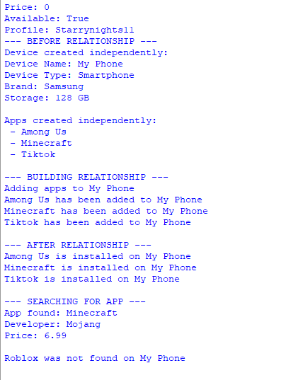

# Class Relationships: Association and Multiplicity
## Previous Work
[Part I - Classes and Objects](classObjectUML.md)
[Part II - Class Attributes and Methods](classAttributesMethods.md)
---
## Existing Class
Class: APPS

Description: My class can function for different needs; entertainment, communication, education or other purposes.

#### Which existing attributes and methods will still be useful when it interacts with another class?

The developer, name, price, available, launch(), download(), updateversion(versionNumber : string) attributes will remain useful. The settings, price, profile can also be used when they interact.

---

## New Related Class
Class: DEVICE

Description: DEVICE is an electronic equipment that people use to do research, to communicate, to entertain or access digital services. Devices can vary in sizes, capabilities and intended purposes.

#### Why should these two classes be connected?

These two classes should be connected because in a DEVICE there is made up of many APPS. The APPS have different features, usages and limits to store and tell information. While a DEVICE is the thing you need to have to have apps, this downloads, launches and other functions that connects these two.

---

## Association
Relationship: DEVICE CONTAINS APPS

Explanation: The relationship of a DEVICE and APPS are that they are both technology-related. Devices are used to run apps or mobile application to access digital services and online features. The class DEVICE provides the hardware and operating system needed for APPS to run. 

---

## Multiplicity
Multiplicity: One to Many DEVICE 1 ───────── 0..* APPS

Explanation: A DEVICE is an electronic that you can download applications on, there are many APPS that contains different features, functions and limits. Inside one device are many applications to compromise of a device.

---

## UML Class Relationship Diagram

## Python Implementation
[View Python Source](classRelationships.py)

## Test Run

## Object Relationship Diagram

---
## Analysis
### What is the association between your two classes?
### What multiplicity did you choose and why?
### How did you implement the relationship in Python?
### Why did you store an object reference instead of copying its data?
### If your relationship uses many, why is a list appropriate?
