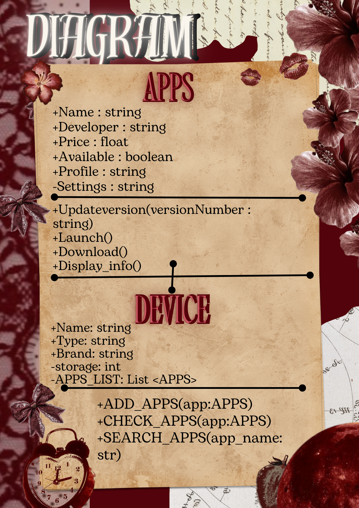
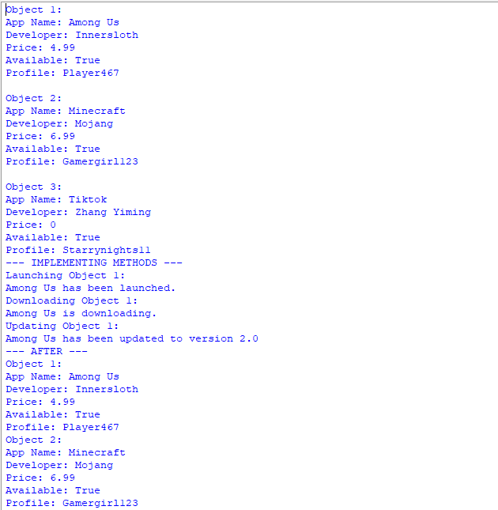
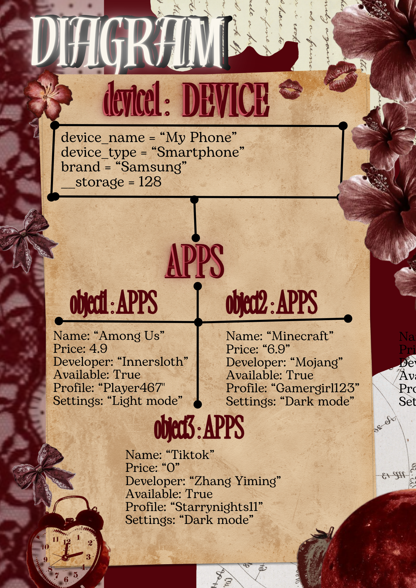

# Class Relationships: Association and Multiplicity
## Previous Work
[Part I - Classes and Objects](classObjectUML.md)
[Part II - Class Attributes and Methods](classAttributesMethods.md)
---
## Existing Class
Class: Apps
Description: My class can function for different needs; entertainment, communication, education or other purposes.

## New Related Class
Class: Devices
Description: Devices are electronic equipment that people use to do research, to communicate, to entertain or access digital services. Devices can vary in sizes, capabilities and intended purposes.

## Association
Relationship: The relationship of devices and apps are that they are both technology-related. Devices are used to run apps or mobile application to access digital services and online features.
Explanation: A device provides the hardware and operating system needed for applications to run. 

## Multiplicity
Multiplicity: Many to Many (* : *)
Explanation:
---
## UML Class Relationship Diagram

## Python Implementation
[View Python Source](classRelationships.py)

## Test Run

## Object Relationship Diagram

---
## Analysis
### What is the association between your two classes?
### What multiplicity did you choose and why?
### How did you implement the relationship in Python?
### Why did you store an object reference instead of copying its data?
### If your relationship uses many, why is a list appropriate?
